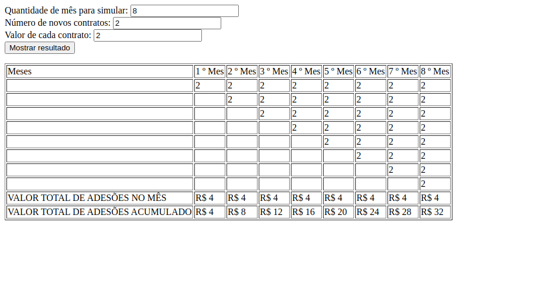

# visao-geral-de-crescimento
A idea desse desafio é você continuar um código que começou ser escrito por um terceiro sem alterá-lo.
Nesse caso, o código já converte o que vem do formulário em uma array de $transacoes. Então você vai
processar essas $transacoes de uma forma que se torne a tabela da forma como é pedida nas simulações 1
e 2.
Seguindo as seguintes regras:
1. A cada 6 meses deve ser criada um nova tabela
2. A tabela seguinte deverá ser uma continuação da tabela anterior, conforme demonstração abaixo
3. A saída deve ser de acordo com os valores informados nos campos do formulário.
Continue implementando esse código para que tenha a seguinte saída:

